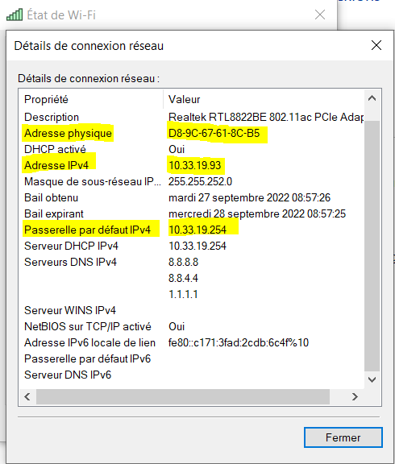
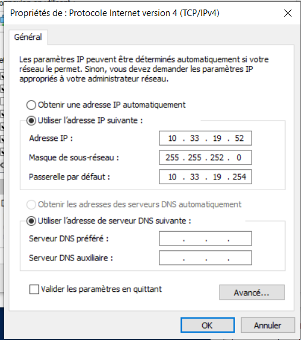
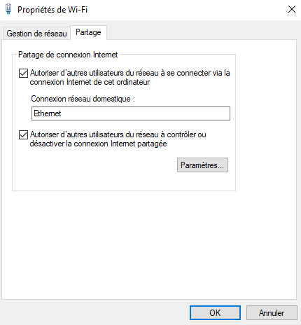
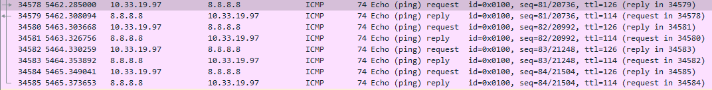
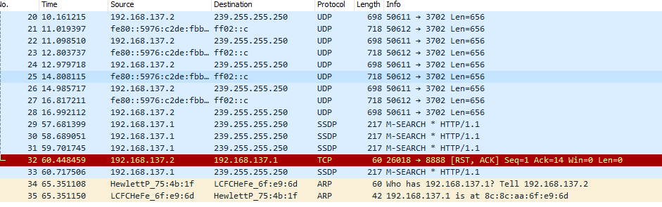

I / Exploration Locale en Solo 

1.
Infos des cartes réseau de ce Pc
    - commande : ipconfig /all
    Wifi :
        Description. . . . . . . . . . . . . . : Realtek RTL8822BE 802.11ac PCIe Adapter
        Adresse physique . . . . . . . . . . . : D8-9C-67-61-8C-B5
        Adresse IPv4. . . . . . . . . . . . . .: 10.33.19.93
        
    Ethernet :
        Description. . . . . . . . . . . . . . : Realtek PCIe GbE Family Controller
        Adresse physique . . . . . . . . . . . : F4-39-09-75-4B-1F
        Ici la carte ethernet ne possède pas d'adresse IP

Gateway
    - commande : ipconfig /all
    Passerelle par défaut. . . . . . . . . : 10.33.19.254

Graphique 
    

La Gateway de Ynov sert à sortir du réseau Ynov, pour pouvoir aller sur d'autres réseaux notamment internet par exemple.

2. 
Modification des informations
    

Il est possible qu'un autre utilisateur ait déjà choisi cette même adresse IP. C'est donc pour cela que l'on perd notre connexion internet car il ne peux pas y avoir 2 utilisateurs connéctés à un même réseau wifi avec la même adresse.

II / Exploration locale en duo 

    3. Modification d'adresse IP 

    On modifife les IP de nos 2 machines dans le réseau en choisissant 192.168.129.1 et 192.168.129.2
        Carte Ethernet Ethernet :
            Adresse IPv4. . . . . . . . . . . . . .: 192.168.129.1(préféré)
            Masque de sous-réseau. . . . . . . . . : 255.255.255.0
            Passerelle par défaut. . . . . . . . . : 192.168.129.2
        
        On voit ici que les adresses ont bien été modifiées.
        En utilisant la commande "ping 192.168.129.2" on obtient le résultat suivant :
            Envoi d’une requête 'Ping'  192.168.129.2 avec 32 octets de données :
            Réponse de 192.168.129.2 : octets=32 temps=2 ms TTL=128
            Réponse de 192.168.129.2 : octets=32 temps=2 ms TTL=128
            Réponse de 192.168.129.2 : octets=32 temps=2 ms TTL=128
            Réponse de 192.168.129.2 : octets=32 temps=2 ms TTL=128
        
        Ce qui prouve bien que l'on a réussi à entrer en contact avec l'autre machine.

        On utilise la commande arp -a pour afficher la table ARP ci-dessous :
            Interface : 192.168.129.1 --- 0x14
            Adresse Internet      Adresse physique      Type
            192.168.0.2           8c-8c-aa-6f-e9-6d     dynamique
            192.168.129.2         8c-8c-aa-6f-e9-6d     dynamique
            192.168.129.255       ff-ff-ff-ff-ff-ff     statique
            224.0.0.2             01-00-5e-00-00-02     statique
            224.0.0.22            01-00-5e-00-00-16     statique
            224.0.0.251           01-00-5e-00-00-fb     statique
            224.0.0.252           01-00-5e-00-00-fc     statique
            39.255.255.250       01-00-5e-7f-ff-fa     statique

    4. Utilisation d'un des deux comme gateway 

    On déconnecte un des deux PC du réseau internet, après avoir défini la passerelle comme étant l'adresse ip de l'autre PC, on peut de nouveau se connecter au réseau internet. 
        
    En démontre le résultat de la commande "ping 1.1.1.1" ou "ping 8.8.8.8" :
        Envoi d’une requête 'Ping'  1.1.1.1 avec 32 octets de données :
        Réponse de 1.1.1.1 : octets=32 temps=27 ms TTL=54
        Réponse de 1.1.1.1 : octets=32 temps=26 ms TTL=54
        Réponse de 1.1.1.1 : octets=32 temps=29 ms TTL=54
        Réponse de 1.1.1.1 : octets=32 temps=26 ms TTL=54

        Statistiques Ping pour 1.1.1.1:
        Paquets : envoyés = 4, reçus = 4, perdus = 0 (perte 0%),
        Durée approximative des boucles en millisecondes :
        Minimum = 26ms, Maximum = 29ms, Moyenne = 27ms

    On peut bien voir grâce à Wireshark que le ping de la machine non connectée directement à internet passe par l'autre machine reliée par ethernet. 
         

    5. Petit chat privé

    En utilisant netcat, on peut lui demander d'écouter sur le port 8888 grâce à la commande : .\nc64.exe -l  -p  8888  
    L'autre utilisateur peut ainsi se connecter au serveur en tapant : nc.exe 192.168.137.1 8888
    
    PS C:\Users\pierr\Downloads\netcat-win32-1.11\netcat-1.11> .\nc.exe -l -p 8888
    ok
    salut  

    En utilisant ".\nc64.exe -l -s 192.168.137.2 -p  8888" on demande à netcat d'écouter seulement sur l'adresse ethernet.
    
    A l'aide de la commande netstat on peut ainsi voir les différentes connexions, 
        TCP    0.0.0.0:8888           0.0.0.0:0              LISTENING  , par exemple ici on peut voir que netcat écoute toutes les IP connéctées au port 8888. 
    
    En revanche ici, 
        TCP    192.168.137.2:8888     0.0.0.0:0              LISTENING  , on peut voir que netcat écoute seulement l'IP 
        192.168.137.2 connectée sur le port 8888.

    6. Firewall 

    Après avoir reactiver le parefeu Windows on peut grâce aux commandes :
        - netsh advfirewall firewall add rule name="ICMP Allow incoming V6 echo request" protocol=icmpv6:8,any dir=in action=allow
        - netsh advfirewall firewall add rule name="ICMP Allow incoming V4 echo request" protocol=icmpv4:8,any dir=in action=allow
    autoriser les pings qui sont des messages de types ICMP 4 et ICMP 6.

    Avec cette commande :
        - netsh advfirewall firewall add rule name="TCP Port 8888" dir=in action=allow protocol=TCP localport=8888
    On peut maintenant demander au Pc serveur d'accepter le trafic sur le port 8888 sans avoir beosin de désactiver le parefeu.

III / Manipulation d'autres outils/protocoles côté client

    1. DHCP

        Commande : ipconfig /all 
        DHCP : 
            Serveur DHCP . . . . . . . . . . . . . : 10.33.19.254
            Bail expirant. . . . . . . . . . . . . : jeudi 29 septembre 2022 08:36:31

    2. DNS 
        Commande : ipconfig /all
        Serveurs DNS. . .  . . . . . . . . . . : 8.8.8.8
                                       8.8.4.4
                                       1.1.1.1
        On peut voir que notre ordinateur connait les serveurs DNS 8.8.8.8 (Google), 8.8.4.4 (Google) et 1.1.1.1 (Cloudflare)

        -- nslookup google.com
        Serveur :   dns.google
        Address:  8.8.8.8

        Réponse ne faisant pas autorité :
        Nom :    google.com
        Addresses:  2a00:1450:4007:806::200e
                216.58.213.78
        
        -- nslookup ynov.com
        Serveur :   dns.google
        Address:  8.8.8.8

        Réponse ne faisant pas autorité :
        Nom :    ynov.com
        Addresses:  2606:4700:20::ac43:4ae2
                2606:4700:20::681a:ae9
                2606:4700:20::681a:be9
                104.26.11.233
                104.26.10.233
                172.67.74.226
    
IV / Wireshark

    Avec l'utilisation de Wireshark on peut observer les trames qui circulent des différentes cartes réseaux. 
    On peut ici voir le resultat d'un ping vers une passerelle 
        
    Ou encore le netcat entre 2 PC branchés via RJ45 
        